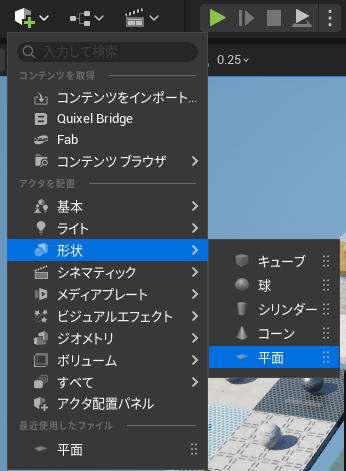
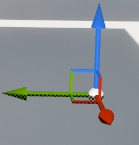
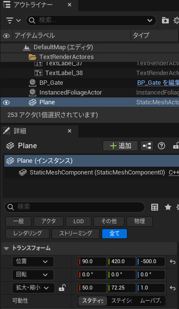
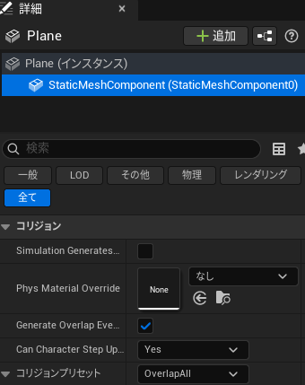
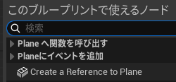
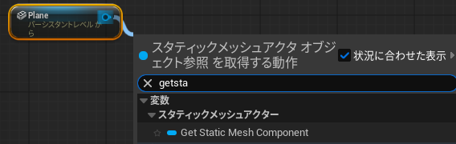
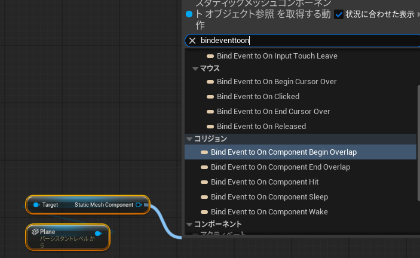
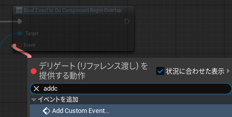
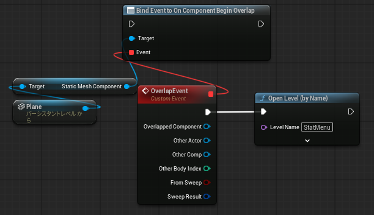
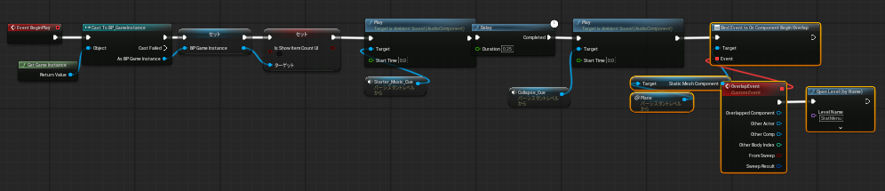

# Unreal Engine 勉強会資料

## ゲームオーバー処理
- 特定の条件を満たしたら、ゲームオーバーとしてStartMenuに戻る処理
- 特定の条件とは？
  - レベルから落下
  - 一定の時間の経過
  - HPが0になる
  - 指定したエリアの外に出る
  - 特定のアイテムを破壊される
  - 敵に発見される　など
## レベルから落下したらゲームオーバー
- レベルから落下したことをどうやって判定するか
  - プレイヤーキャラクターの位置情報を常にチェックする
  - 決まった秒数以上落下状態が続いている
  - 落下先に配置したオブジェクトに当たったら落下とする
  - 落下によるHP減少イベントを設定し、HPが0になったら終了

## 落下先に配置したオブジェクトに当たったら落下する処理の実装
- アクタを配置>形状>平面(Plane)を選択してレベル上に追加
  - 
- 追加したPlaneの位置・サイズを調整する
  - Gizmo
    - ビューポートでオブジェクトを選択すると表示される
    - スペースキーで位置・回転・スケールが切り替わり、Gizmoをドラッグで各軸の操作ができる
    - 
  - トランスフォーム入力
    - 詳細タブ>トランスフォームから数値を直接入力して変更する
    - 

- Planeを選択し、詳細>StaticMeshComponentからコリジョン設定をを追加する
  - GenerateOverlapEventにチェック
  - コリジョンプリセットをOverlapAllに設定
  - 
- Planeを選択した状態でレベルBPを開き、右クリックでCreate a Reference to Planeを選択
  - 
- PlaneノードからGetStaticMeshComponentを追加
  - 
- StaticMeshComponentノードからBind Event to On Component Begin Overlapを追加
  - 
- Bind Event to On Component Begin OverlapノードのEventからAdd Custom Eventを選択
  - カスタムイベントの名称はわかりやすい名前に変更しておく
  - 
- カスタムイベントからOpenLevelノードをつなぎ、LevelNameにStartMenuを入力する
  - 
- Bind Event to On Component Begin OverlapノードをBeginPlayからつながる処理の一番最後につなげる
  - 

