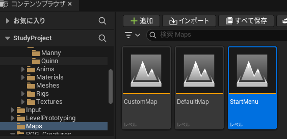
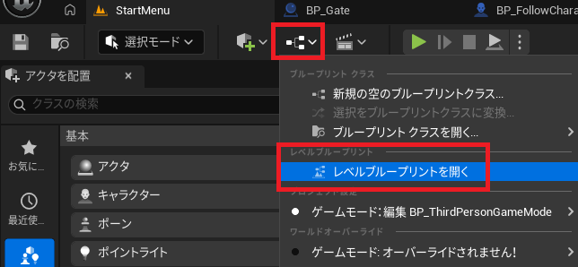
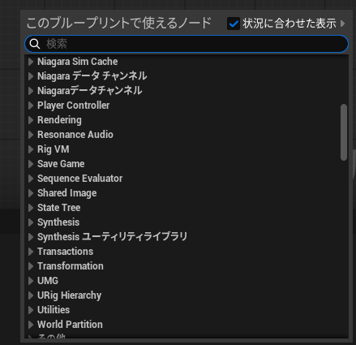
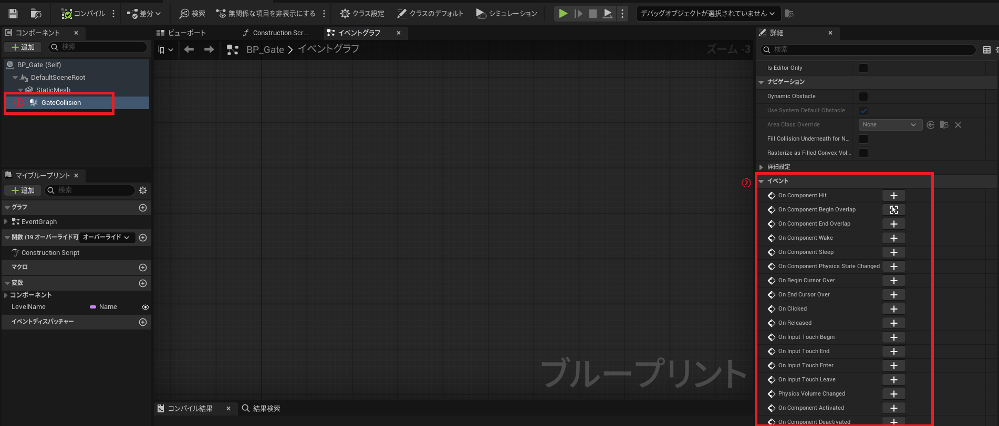

# Unreal Engine 勉強会資料
- [Unreal Engine 勉強会資料](#unreal-engine-勉強会資料)
- [UnrealEngineとは](#unrealengineとは)
  - [Unity と Unreal Engine の違い](#unity-と-unreal-engine-の違い)
    - [まとめ](#まとめ)
  - [Unreal Engine を使用する場合の推奨環境](#unreal-engine-を使用する場合の推奨環境)
  - [初めてのゲームエンジンはUE or Unity?](#初めてのゲームエンジンはue-or-unity)
- [UnrealEngineの実装](#unrealengineの実装)
  - [Unreal Engine の主要用語](#unreal-engine-の主要用語)
  - [テンプレートプロジェクト](#テンプレートプロジェクト)
  - [AIアシスタント機能](#aiアシスタント機能)
  - [過去にあった質問](#過去にあった質問)
  - [操作方法](#操作方法)
    - [レベルBPの開き方](#レベルbpの開き方)
    - [BPノードの出し方](#bpノードの出し方)
    - [ビルド](#ビルド)
  - [勉強会用テンプレートプロジェクトへの機能追加案](#勉強会用テンプレートプロジェクトへの機能追加案)
- [関連資料](#関連資料)

# UnrealEngineとは
## Unity と Unreal Engine の違い

* グラフィック性能
    * Unreal Engine (UE): 高品質なリアルタイムレンダリングが可能。映画品質のグラフィックを提供。
    * Unity: 比較的軽量で、2D/3Dゲームの開発が可能。モバイル向けやインディー開発に適している。
* 開発環境
    * UE: C++とBluePrint（ビジュアルスクリプティング）を使用。
    * Unity: C#を使用。
* 価格
    *  UE: 一定の収益を超えた場合にロイヤリティが発生。
    * Unity: 基本的に無料だが、Pro版は有料。
* エンジンの用途
    * UE: AAAタイトルやフォトリアリスティックなゲーム向け。
    * Unity: モバイルゲームやインディー開発向け。

### まとめ

* UE
    * グラフィックのレベルが高い（そのため開発PCのスペックも必要）
    * C++の知識がなくても最低限のプログラミング知識があれば、BluePrintだけで簡単なゲームが作れる
    * 大規模な開発にはC++の知識が必須
* Unity
    * 開発PCの要求スペックがそこまで高くない
    * C#の知識があれば実装可能

## Unreal Engine を使用する場合の推奨環境

* 最低要件
    * OS: Windows 10 64*bit / macOS Monterey 以上
    * CPU: Intel i5*8400 / AMD Ryzen 5 2600 以上
    * RAM: 8GB 以上
    * GPU: NVIDIA GTX 970 / AMD Radeon RX 480 以上
    * ストレージ: SSD 推奨（50GB 以上の空き容量）

* 推奨要件
    * OS: Windows 10 64*bit 以上 / 最新の macOS
    * CPU: Intel i7*12700K / AMD Ryzen 7 5800X 以上
    * RAM: 32GB 以上
    * GPU: NVIDIA RTX 3080 / AMD Radeon RX 6800 XT 以上
    * ストレージ: NVMe SSD（1TB 以上推奨）
* ハイエンドなゲーミングPCであれば問題なく動作する
* [動作環境](https://dev.epicgames.com/documentation/ja*jp/unreal*engine/hardware*and*software*specifications*for*unreal*engine)

## 初めてのゲームエンジンはUE or Unity?

* UEがおすすめ
    * グラフィックにこだわりたい
    * ゲームではなくリアルな映像作品が作りたい
    * C#やC++の経験はないけどゲームエンジンを使いたい
* Unityがおすすめ
    * 持っているPCのスペックが高くないが、とにかくゲームエンジンを使いたい
    * モバイルゲームや2Dゲームが作りたい
    * C#の知識がある  

# UnrealEngineの実装
## Unreal Engine の主要用語

* 基本機能
    * Actor 
        * UEの基本的なオブジェクトの単位。すべてのゲームオブジェクトは Actor クラスを継承する。
        * UnityのGameObjectやPrefabと同じような存在
    * Component
        * Actor に付与することで機能を拡張できる要素。StaticMeshComponent や LightComponent などがある
    * Level
        * ゲーム内のマップやステージを構成する単位。レベルには地形、オブジェクト、ライティング、スクリプトが含まれる。
    * BluePrint（BP）
        * UEのビジュアルスクリプティングシステム。C++の知識がなくてもプログラミングの基礎知識があればゲームのロジックを作成可能。
* 見た目
    * StaticMesh
        * 静的な3Dオブジェクトのデータ。動かないオブジェクトの描画に適している。
    *  SkeletalMesh
        * アニメーション可能な3Dモデル。ボーン構造を持ち、キャラクターやクリーチャーに使用される。
    * Material
        * 3Dオブジェクトの見た目を決定する要素。色や反射、透明度などのパラメータを設定できる。
    * Texture
        * マテリアルに適用される画像データ。表面の細かい模様や色を表現するために使用される。
    * Shader
        * マテリアルのレンダリング方法を決定するプログラム。ライティングやエフェクトの計算を行い、リアルな表現を実現する。

## テンプレートプロジェクト
* UEには複数のテンプレートプロジェクトが用意されている
* ゲーム
    * Third Personゲーム
        * 三人称ゲームのテンプレート
            * 一般的なゲームに必要な処理(WASDキーでプレイヤー移動・スペースキーでジャンプ・マウスでカメラ移動)は組み込まれている
    * FitstPersonゲーム
        *  FPSゲームのテンプレート
    *  TopDown
        *  カメラがキャラクター上部に固定されているゲームのテンプレート
    *  AR
        *  AndroidまたはiOSにデプロイ可能なARアプリケーションを作成するためのテンプレート
    *  VR
        *  VRゲームのテンプレート
    *  映画、テレビ、ライブ イベント
    *  建築、土木、建設
    *  自動車、製造設計、製造
    *  シミュレーション

[テンプレート](https://dev.epicgames.com/documentation/ja-jp/unreal-engine/unreal-engine-templates-reference)

## AIアシスタント機能
* 5.7からAIアシスタント機能（実験バージョン）が追加
  * 編集＞プラグインでAI Assistantにチェックを入れて再起動
  * ウィンドウ＞アシストのAI Assistant押下でAIアシスタントウィンドウが起動
  * Editor内での検索が可能になっている

## 過去にあった質問
* エディタの言語は英語にしておくべきか？
  * UEに慣れるまでは日本語設定にして、慣れたら英語のほうが良い
  * 日本語のエラーメッセージが文字化けすることがあったり、最新機能は日本語の情報が少ないことがある。C++の実装を併用したり、最新機能を利用するのであれば英語のほうが良い

## 操作方法
### レベルBPの開き方
1. コンテンツドロワーからレベルBPを選択する
-  
2.  エディタメニューのアイコンから「レベルブループリントを開く」を選択する
-  
### BPノードの出し方
- 通常ノード
  - イベントグラフ内で右クリック→使用するノード名を検索
  - 
- OnClickやOnHit等の特定のUIやコンポーネントに紐づいたノード
  1. 階層タブやコンポーネントタブでイベントを追加したいアイテムを選択
  2. 詳細タブの最下部のイベントから追加したいノードを選択
  - 
### ビルド
- BPやレベルを変更後
  - エディタメニューのコンパイルが？マークになっているときは、必ずクリックしてコンパイルをした後保存する
  - 
- ゲームをプレイ
  - エディタメニューのプレイボタン押下で、開いているレベルからスタート可能
  - 

## 勉強会用テンプレートプロジェクトへの機能追加案
- UIの変更
  - メニューの名称・スタートメニューの変更
  - メインメニューの背景・デザインの変更
  - Exitボタン押下時の確認ウィンドウ追加
  - 機能に合わせたUIの追加
- 見た目の変更
  - キャラクターのStaticMesh・Materialの変更
  - レベル上のオブジェクトの変更
  - Fabから取得したアセットで、レベルをカスタマイズする 
- プレイヤーキャラクターへの処理の追加
  - HPシステムの追加
  - アイテム取得処理の追加
  - 敵キャラクターを倒す処理の追加
  - アニメーションの追加
  - 敵キャラクターの種類ごとに処理を変更
- プレイヤー以外のキャラクター処理の追加
  - 敵の攻撃システムの追加
  - 敵キャラクターがプレイヤーに攻撃された時の処理の追加
  - 新キャラクターの追加
  - 仲間キャラクターへの処理の追加
- ゲーム全体の処理の追加
  - LevelStreamingでのワールドの切り替え・新規ワールド追加
  - レベルを変更しても同じ情報を保持する処理
  - セーブシステム
  - 新規キー入力追加
  - プレイ中のメニューの追加
  - マルチプレイ化
  - PixelStreamingの実装
- BPで実装した上記の処理をC++でも実装してみる

# 関連資料
- 書籍
  - 湊 和久 『Unreal Engine 5で極めるゲーム開発：サンプルデータと動画で学ぶゲーム制作プロジェクト』ボーンデジタル
  - 平澤章　『オブジェクト指向でなぜつくるのか 第3版 知っておきたいOOP、設計、アジャイル開発の基礎知識』日経BP
  - ビジュアル情報処理 -CG・画像処理入門-改訂新版 (CGエンジニア検定ベーシック教科書)
- サイト
  - [株式会社ヒストリア](https://historia.co.jp/archives/)
  - [ゲームメーカーズ](https://gamemakers.jp/)
  - [Unity使いがUEも習得するための入門Tips & Unity使いへのUE教育事例紹介](https://www.docswell.com/s/EpicGamesJapan/KLVDXL-UE_UFT25_TSUBASAMUSU_PATE)
  - [UnrealEngine5の教科書 [ゲーム開発入門編,第一巻]](https://zenn.dev/daichi_gamedev/books/unreal-engine-tutorial)
