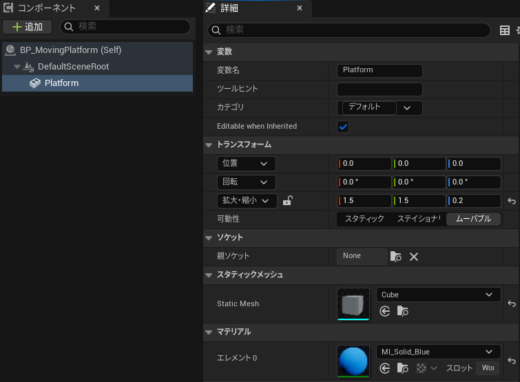
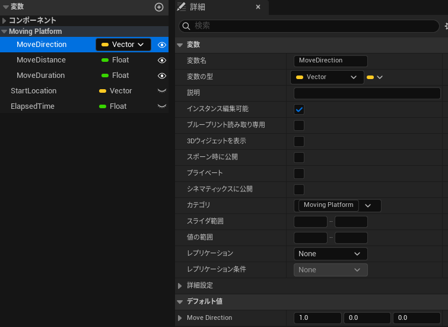
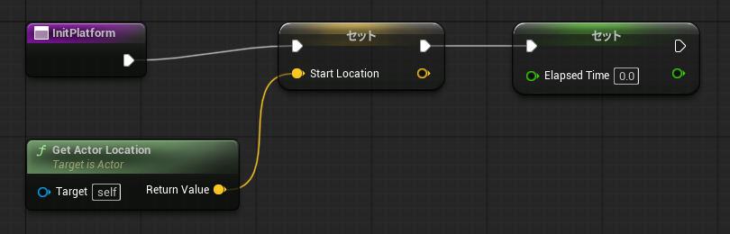
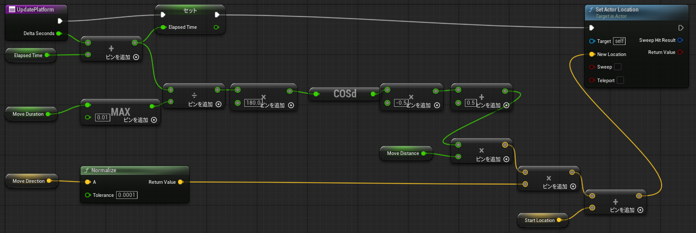
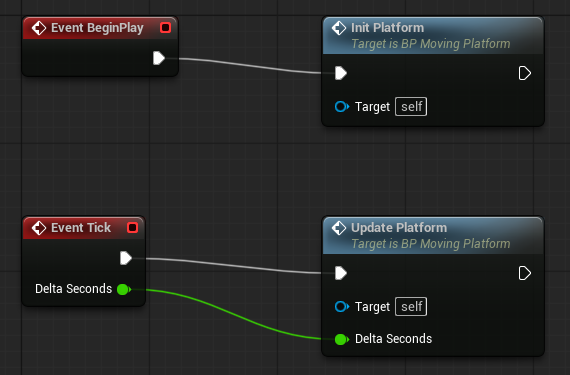
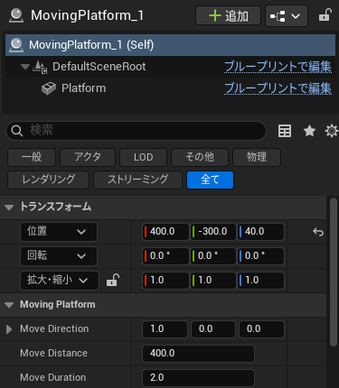

# Unreal Engine 勉強会資料

## 動く床
- キャラクターが乗ると一緒に運ばれる、往復移動する床を作る
- 実装はBlueprint(BP)のみで行う
- 移動方向・移動距離・移動時間はレベルに配置した床ごとに詳細パネルから変更できるようにする
- 作成したもの
  - BP：`Content/BluePrint/BP_MovingPlatform`
  - 配置先：`CustomMap`（アクタ名 `MovingPlatform_1`）

## 動く床の考え方
- 床を動かす方法はいくつかある
  - Tickで毎フレーム位置を計算して `SetActorLocation` する（今回の方法）
  - Timelineノードで0→1の値を作り、Lerpで位置を補間する
  - InterpToMovementコンポーネントを使う
- 今回はTick + 計算で実装する
  - 処理の流れがすべてノードで見えるので、仕組みを理解しやすい
  - 「ゲーム開始から何秒たったか」だけで位置が決まるので、何回往復しても位置がズレない

## 床の位置の決め方（計算の考え方）

### ステップ1：「どこまで進んだか」を割合で考える
- 床はスタート地点とゴール地点の間を行ったり来たりする
- 今どこにいるかを「スタートからゴールまでの何％の所にいるか」で表す
  - 0％ … スタート地点
  - 50％ … ちょうど真ん中
  - 100％ … ゴール地点
- この割合をBPでは **α(アルファ)** という名前で呼ぶ（0％ = 0.0、100％ = 1.0）
- αさえ分かれば、床の位置は次のように決められる

```
床の位置 = スタート地点 + (進む向き × 進む距離 × α)
```

- 例：スタート地点がX=400、向きが+X、距離が400cmのとき
  - α = 0.0 → 400 + 400×0.0 = **X=400**（スタート）
  - α = 0.5 → 400 + 400×0.5 = **X=600**（真ん中）
  - α = 1.0 → 400 + 400×1.0 = **X=800**（ゴール）

### ステップ2：αを時間で 0 → 1 → 0 → 1 … と変化させる
- あとは「時間がたつとαが 0 → 1 → 0 → 1 … と行ったり来たりする」ようにすれば、床が往復する
- 一番シンプルなのは、一定の速さで増やして、1になったら減らす方法
  - ただしこの方法だと、端に着いた瞬間に急に逆向きになる
  - 乗っているキャラクターがガクッと揺れる原因になる
- そこで今回は **cos(コサイン)** を使う
  - cosは数学の関数だが、ここでは「ブランコのように自然に行ったり来たりする値を作る道具」と思えばOK
  - ブランコは端に近づくとだんだん遅くなり、一瞬止まってから戻ってくる
  - cosを使うと床も同じように、端でゆっくり止まって折り返す

### ステップ3：cosでαを作る
- cosに角度を入れると、-1 〜 1 の間の値が返ってくる

| 角度 | 0° | 90° | 180° | 270° | 360° |
|---|---|---|---|---|---|
| cos(角度) | 1 | 0 | -1 | 0 | 1 |

- このままだと「1 → -1 → 1」なので、αとして使える「0 → 1 → 0」に変換する
  - ① cosの値に **-0.5** を掛ける → 「-0.5 → 0.5 → -0.5」
  - ② **0.5** を足す → 「0 → 1 → 0」 ← これがα！

| 角度 | 0° | 90° | 180° | 270° | 360° |
|---|---|---|---|---|---|
| cos(角度) | 1 | 0 | -1 | 0 | 1 |
| ① × -0.5 | -0.5 | 0 | 0.5 | 0 | -0.5 |
| ② + 0.5 = **α** | **0** | **0.5** | **1** | **0.5** | **0** |
| 床の位置 | スタート | 真ん中 | ゴール | 真ん中 | スタート |

### ステップ4：時間を角度に変換する
- 最後に「経過時間」を「角度」に変換する
- 片道(スタート→ゴール)を180°、往復を360°にしたいので

```
角度 = 経過時間 ÷ 片道にかかる秒数 × 180
```

- 例：片道2秒(MoveDuration = 2.0)のとき

| 経過時間 | 角度の計算 | 角度 | α | 床の位置(X) |
|---|---|---|---|---|
| 0秒 | 0 ÷ 2 × 180 | 0° | 0 | 400(スタート) |
| 1秒 | 1 ÷ 2 × 180 | 90° | 0.5 | 600(真ん中) |
| 2秒 | 2 ÷ 2 × 180 | 180° | 1 | 800(ゴール) |
| 3秒 | 3 ÷ 2 × 180 | 270° | 0.5 | 600(真ん中) |
| 4秒 | 4 ÷ 2 × 180 | 360° | 0 | 400(スタート) |

- 5秒以降も角度は増え続けるが、cosは360°ごとに同じ値を繰り返すので、床もずっと往復し続ける

### まとめ：毎フレームやっていること
1. 経過時間を増やす（前回の経過時間 + 前のフレームからの時間）
2. 経過時間を角度に変換する
3. cosを使って角度からα(0〜1)を作る
4. スタート地点 + 向き × 距離 × α で床の位置を求めて、床を移動する

### 移動方向を「正規化」する理由
- 正規化(Normalize)とは、ベクトルの向きはそのままで長さを1にすること
- 詳細パネルで方向に (0,0,5) と入力しても、(0,0,1) に直してから使う
- こうしないと、方向の数字を大きくしただけで移動距離まで変わってしまう
- 正規化しておけば「向きは MoveDirection、距離は MoveDistance」ときれいに役割を分けられる

### キャラクターが一緒に運ばれる理由
- キャラクターのCharacterMovementコンポーネントは、足元の床が動くとキャラクターも一緒に動かす仕組みを持っている
- そのため床側で特別な処理をしなくても、`SetActorLocation` で床を動かすだけで乗っているキャラクターが運ばれる
- 床のコンポーネントのMobilityは `Movable` にしておく必要がある

## 動く床の作成手順

### 1. Blueprintクラスを作成
- コンテンツブラウザで `BluePrint` フォルダを開く
- 右クリック>ブループリントクラス>`Actor` を選択
- 名前を `BP_MovingPlatform` にする

### 2. 床のメッシュを追加
- BPエディタのコンポーネントタブで追加>`Static Mesh` を選択し、名前を `Platform` にする
- `Platform` を選択し、詳細パネルで以下を設定する

| 項目 | 設定値 | 理由 |
|---|---|---|
| Static Mesh | `/Engine/BasicShapes/Cube` | 1辺100cmの立方体 |
| スケール | X=1.5, Y=1.5, Z=0.2 | 150×150×20cm。キャラクター1人が乗れるサイズ |
| マテリアル | `MI_Solid_Blue` | 床だとわかりやすくする |
| Mobility | `Movable` | 動かすため |

- `DefaultSceneRoot` のMobilityも `Movable` にしておく
  - 

### 3. 変数を追加
- マイブループリントタブの変数から＋で追加する

| 変数名 | 型 | インスタンス編集可能 | カテゴリ | 初期値 | 用途 |
|---|---|---|---|---|---|
| MoveDirection | Vector | ○ | Moving Platform | (1, 0, 0) | 移動方向 |
| MoveDistance | Float | ○ | Moving Platform | 400 | 移動距離(cm) |
| MoveDuration | Float | ○ | Moving Platform | 2.0 | 片道にかかる秒数 |
| StartLocation | Vector | × | デフォルト | - | スタート地点の記録用 |
| ElapsedTime | Float | × | デフォルト | - | 経過時間の記録用 |

- 「インスタンス編集可能」にチェックを入れた変数は、レベルに配置した床の詳細パネルに表示され、床ごとに値を変えられる
  - 変数の横の目のアイコンをクリックしても切り替えられる
- カテゴリを `Moving Platform` にすると、詳細パネルでまとめて表示される
- 初期値はコンパイル後に変数を選択し、詳細パネルのデフォルト値から入力する
  - 

### 4. 関数 InitPlatform を作成（スタート地点の記録）
- マイブループリントタブの関数から＋で `InitPlatform` を追加
- ゲーム開始時の床の位置を `StartLocation` に保存し、経過時間 `ElapsedTime` を0に戻す
  - `GetActorLocation` → `Set StartLocation`
  - `Set ElapsedTime` に 0 を設定
  - 

### 5. 関数 UpdatePlatform を作成（毎フレームの移動）
- 関数 `UpdatePlatform` を追加し、入力に `DeltaSeconds`(Float) を追加
- 「床の位置の決め方」で説明した計算をノードで組む
  - 
- グラフは上から3段に分かれていて、それぞれ「まとめ：毎フレームやっていること」の手順に対応している

| 段 | やっていること | 使っているノード（左から順に） |
|---|---|---|
| 上段 | ① 経過時間を増やす | `Delta Seconds` と `Elapsed Time` を `+` で足して、`セット(Elapsed Time)` で保存 |
| 中段 | ② 経過時間を角度に変換<br>③ 角度からαを作る | `MAX`（`Move Duration` と 0.01 の大きい方）→ `÷` → `× 180.0` → `COSd` → `× -0.5` → `+ 0.5` |
| 下段 | ④ 床の位置を求めて移動 | `Move Distance` × α → `Normalize(Move Direction)` と掛ける → `Start Location` と `+` → `Set Actor Location` の `New Location` へ |

- 中段のポイント
  - `MAX` は「片道の秒数」が0だと割り算できなくなるので、最低でも0.01秒になるようにする保険
  - `COSd` は `Cos(Degrees)` ノード。角度を「度(°)」で渡すためのcos（`Cos(Radians)` とは別物なので注意）
  - `× -0.5` → `+ 0.5` で、cosの「1 → -1 → 1」をαの「0 → 1 → 0」に変換している
- 下段のポイント
  - `Normalize` で向きの長さを1にしてから距離とαを掛けている
  - 最後の `+` で「スタート地点 + 移動量」を計算し、`Set Actor Location` で床を動かす

- 実行ピン(白い線)は `UpdatePlatform → Set ElapsedTime → SetActorLocation` の順につなぐ
  - 計算だけのノード(ピュアノード)には実行ピンはないので、つながなくてよい
- `Cos` ノードは `Cos(Degrees)` を選ぶ（角度を「度」で渡すため。`Cos(Radians)` とは別物）

### 6. イベントグラフで関数を呼び出す
- `Event BeginPlay` から `InitPlatform` を呼ぶ
- `Event Tick` から `UpdatePlatform` を呼び、`Delta Seconds` を `DeltaSeconds` につなぐ
  - 
- 処理を関数に分けておくと、イベントグラフがすっきりして何をしているか読みやすくなる

### 7. コンパイルと配置
- コンパイルして保存する
- `CustomMap` を開き、コンテンツブラウザから `BP_MovingPlatform` をレベルにドラッグして配置する
  - 今回は (X=400, Y=-300, Z=40) に配置
- 配置した床を選択し、詳細パネルの `Moving Platform` カテゴリで方向・距離・時間を調整する
  - 

## 設定例

| やりたいこと | MoveDirection | MoveDistance | MoveDuration |
|---|---|---|---|
| 前後に4m往復 | (1, 0, 0) | 400 | 2.0 |
| 左右に6mゆっくり往復 | (0, 1, 0) | 600 | 4.0 |
| エレベーターのように上下 | (0, 0, 1) | 300 | 3.0 |
| 斜め上に移動 | (1, 0, 1) | 500 | 2.5 |

## 動作確認
- PIE(プレイ)で床が往復することを確認する
- キャラクターを床に乗せて、一緒に運ばれることを確認する
- 詳細パネルの値を変えて、方向・距離・速さが変わることを確認する

## 発展課題
- 終点で数秒止まるようにする（αの計算に待ち時間を入れる、またはDelayを使う）
- キャラクターが乗ったときだけ動き出すようにする（Box Collisionを追加してOverlapイベントで開始）
- 回転する床を作る（`SetActorRotation` を使う）
- Timelineノードを使って同じ動きを実装し、Tick版と比べる
